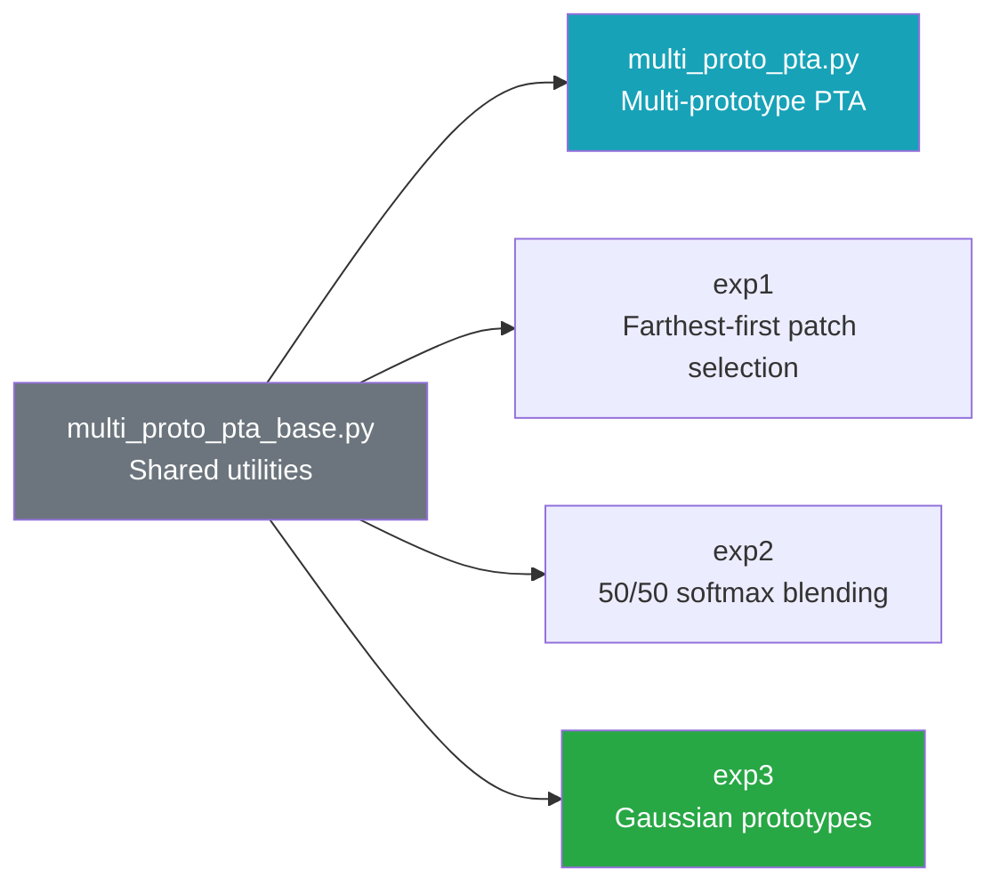
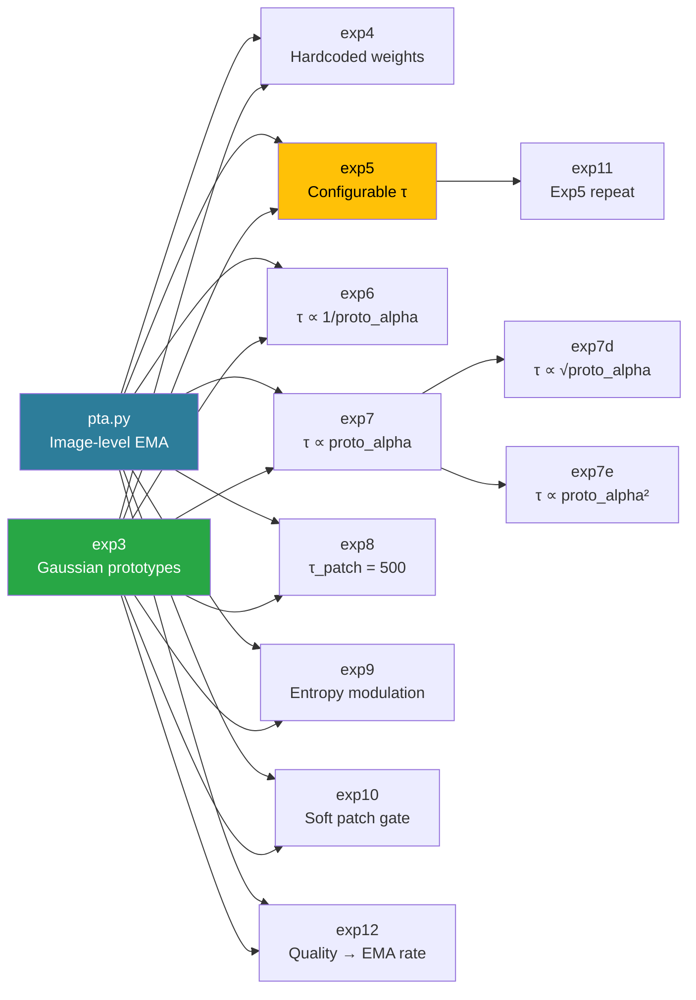

# Multi-Prototype PTA — Experiment Log

**Date**: 2026-06-29
**Commit**: [`2947b7b`](https://github.com/hzhxmu/PTA/commit/2947b7b) (initial commit — all MPTA variants implemented in one shot)

---

## Overview

The original **PTA** (`models/pta.py`) maintains a single prototype per class and updates it via exponential moving average at test time.

**MultiProtoPTA** (`models/multi_proto_pta.py`) extends this by keeping **multiple patch-level prototypes per class** learned through incremental K-means. This allows the model to capture multi-modal visual concepts within each class (e.g., dog faces, dog paws, dog fur) and match them independently.

The core pipeline is shared across all three experiments:
1. Extract patch embeddings from CLIP's ViT
2. Maintain a per-class memory bank of prototypes (patch-level centroids)
3. Score each class by matching image patches against its prototypes
4. Fuse prototype scores with CLIP text logits
5. Update prototype banks using confident pseudo-labels

---

## Dependency Tree

All experiments branch from the original PTA method (`models/pta.py`). The diagrams below show the import dependency chain — each node imports from its parent(s).

### Branch 1: Multi-Proto (Patch-Level)

These experiments build on `multi_proto_pta_base.py` (shared utilities: normalize, incremental k-means, patch extraction).



### Branch 2: Three-Way Fusion Family

These experiments import from **both** `pta.py` (image-level EMA) **and** `exp3` (Gaussian patch prototypes), fusing three signals: CLIP text + image-level prototype + patch-level prototype.



### Import Dependency Summary

| File | Imports from | Relationship |
|---|---|---|
| `pta.py` | `base.py`, `utils.py` | **Root** — image-level EMA prototypes |
| `multi_proto_pta_base.py` | `base.py`, `utils.py` | **Shared utilities** — normalize, k-means, patch extract |
| `multi_proto_pta.py` | `multi_proto_pta_base` | Patch-level prototypes + CLIP text |
| `exp1` | `multi_proto_pta_base` | Farthest-first patch selection |
| `exp2` | `multi_proto_pta_base` | 50/50 softmax score blending |
| `exp3` | `multi_proto_pta_base` | Gaussian prototypes (center + variance) |
| `exp4` | `pta` + `exp3` | 3-way fusion (hardcoded weights) |
| `exp5` | `pta` + `exp3` | 3-way fusion (configurable τ) |
| `exp6` | `pta` + `exp3` | Per-class adaptive weight (inverse) |
| `exp7` | `pta` + `exp3` | Per-class adaptive weight (direct) |
| `exp7d` | `pta` + `exp3` | Exp7 with sqrt mapping |
| `exp7e` | `pta` + `exp3` | Exp7 with square mapping |
| `exp8` | `pta` + `exp3` | 25× patch boost |
| `exp9` | `pta` + `exp3` | Entropy-guided τ modulation |
| `exp10` | `pta` + `exp3` | Soft per-class proportional gate |
| `exp11` | `exp5` (subclass) | Same algo, different config |
| `exp12` | `pta` + `exp3` | Patch quality → EMA update rate |

---

## Experiment 1: Fixed Unique Patches

**File**: `models/exp1_fixed_unique_patches.py`  
**Config**: `configs_exp1/*.yaml`

### Key change vs MultiProtoPTA

| Aspect | MultiProtoPTA | Exp1 |
|---|---|---|
| Patch selection | Threshold-based grouping (`patch_group_threshold=0.9`) | Farthest-first diversity selection |
| Patch count per sample | Variable (depends on image content) | Fixed (`n_unique_patches_per_sample=15`) |
| Patch grouping | Greedy merge of similar patches | No merging — keeps maximally-diverse patches |

### Motivation

The threshold-based grouping in the base MPTA can produce wildly different patch counts per image. Using `exclude_pos=True` also causes aggressive merging of patches. Exp1 stabilizes the input representation by always picking exactly `n` patches that are farthest apart from each other, ensuring consistent downstream behavior.

### Implementation detail

```python
# Greedy farthest-first: seed with centroid-closest, then iteratively
# add the patch that is least similar to any already-selected one.
def _select_diverse_patches(patches_norm, n):
    ...
```

### Config

```yaml
match_threshold: 0.60
max_K: 100
conf_threshold: 0.5
n_half: 15.0
soft_nn_top_m: 4
alpha_max: 0.2
quality_eps: 0.001
exclude_pos: false
n_unique_patches_per_sample: 15    # ← Exp1-specific
```

---

## Experiment 2: Adaptive Tau Proto (50/50 Score Blending)

**File**: `models/exp2_adaptive_tau_proto.py`  
**Config**: `configs_exp2/*.yaml`

### Key change vs MultiProtoPTA

| Aspect | MultiProtoPTA | Exp2 |
|---|---|---|
| Fusion strategy | `text_logits + tau_proto * alpha * quality_gate * delta_proto` | `softmax(text_logits) * 0.5 + softmax(proto_scores) * 0.5` |
| Hyperparameters | `tau_proto=20, alpha_max=0.2, quality_eps=1e-3` | `blend_text_weight=0.5, blend_proto_weight=0.5` |
| Prototype aggregation | Always top-M mean | Top-M if `K ≥ min_protos_full_agg`, else mean of all |

### Motivation

The exponential weighting scheme in MPTA (`tau_proto * alpha * quality_gate`) introduces three coupled hyperparameters that are dataset-dependent and hard to tune. Exp2 replaces this with a principled 50/50 softmax blend. Both scores live on the same [0,1] probability scale, making the blend model-agnostic and interpretable.

Additionally, for classes with very few prototypes (`K < min_protos_for_full_agg`), the mean of all prototype scores is used instead of top-M, which is more robust against low-sample noise.

### Config

```yaml
match_threshold: 0.60
max_K: 100
conf_threshold: 0.5
n_half: 15.0
soft_nn_top_m: 4
alpha_max: 0.2
quality_eps: 0.001
exclude_pos: false
blend_text_weight: 0.5        # ← Exp2-specific
blend_proto_weight: 0.5       # ← Exp2-specific
min_protos_for_full_agg: 5    # ← Exp2-specific
```

---

## Experiment 3: Gaussian Prototypes

**File**: `models/exp3_gaussian_prototypes.py`  
**Config**: `configs_exp3/*.yaml`

### Key change vs MultiProtoPTA

| Aspect | MultiProtoPTA | Exp3 |
|---|---|---|
| Prototype representation | Center vector only | Center + per-dimension variance (Gaussian) |
| Matching function | Cosine similarity (`cos(center, patch)`) | Gaussian score (`exp(-0.5 * Σ (patch - center)² / variance)`) |
| Variance tracking | N/A | EMA-updated per prototype + per-dimension |
| New param | — | `gaussian_ema=0.1, variance_min=0.001, variance_max=1.0` |

### Motivation

Cosine similarity treats all feature dimensions equally, but some dimensions may be more informative for a given prototype. By modelling each prototype as a Gaussian (center + variance), Exp3 naturally:
- **Downweights** dimensions with high variance (uncertain/noisy features)
- **Upweights** dimensions with low variance (tight, high-confidence features)
- **Downweights** entire prototypes with high overall variance (poorly-formed clusters)

The variance is initialized conservatively (10× `variance_min` for new prototypes) and updated via EMA from the per-dimension variance of matching patches.

### Config

```yaml
match_threshold: 0.60
max_K: 100
conf_threshold: 0.5
n_half: 15.0
soft_nn_top_m: 4
alpha_max: 0.2
quality_eps: 0.001
exclude_pos: false
gaussian_ema: 0.1       # ← Exp3-specific
variance_min: 0.001     # ← Exp3-specific
variance_max: 1.0       # ← Exp3-specific
```

---

## Experiment 4: Full Fusion (Three-Branch, Fixed Weights)

**File**: `models/exp4_full_fusion.py`  
**Config**: `configs_exp4/*.yaml`

### Key change vs Exp3

| Aspect | Exp3 (Gaussian) | Exp4 (Full Fusion) |
|---|---|---|
| Logit branches | 2 (text + patch-level Gaussian) | 3 (text + image-level PTA + patch-level Gaussian) |
| Image-level prototype | None | PTA-style EMA per class, permissive update gate |
| Patch-level prototype | Gaussian (center + variance) | Same as Exp3, but with strict confidence + margin gate |
| Fusion weights | `text_logits + tau_proto * alpha * quality_gate * delta_proto` | `clip_logits + 100.0 * image_proto_logits + tau_proto * proto_alpha * quality_gate * patch_proto_logits` |
| Update gate (image-level) | N/A | Permissive: any class with softmax prob ≥ 0.1 |
| Update gate (patch-level) | Confidence threshold only | Strict: top-1 CLIP confidence ≥ `conf_threshold` **AND** margin ≥ `conf_margin_threshold` |

### Motivation

Exp3 showed that Gaussian prototypes alone don't close the gap to PTA. Exp4 hypothesizes that combining *both* image-level prototypes (PTA's strength: stable, per-sample EMA) *and* patch-level Gaussian prototypes (MPTA's strength: multi-modal visual concepts) may capture complementary signals. The image-level branch provides a strong baseline signal, while the patch-level branch adds fine-grained discrimination for complex classes.

The dual-gate strategy is intentional: the image-level branch updates frequently (permissive gate) to maintain responsive prototypes, while the patch-level branch updates conservatively (strict gate) to avoid corrupting Gaussian parameters with noisy samples.

### Config

```yaml
# Image-level prototype (PTA)
alpha: 0.01
T: 50.0

# Patch-level Gaussian prototype (Exp4)
match_threshold: 0.60
max_K: 100
conf_threshold: 0.5
conf_margin_threshold: 0.05    # ← Exp4-specific
n_half: 15.0
soft_nn_top_m: 4
proto_alpha_max: 0.2
quality_eps: 0.001
exclude_pos: false
patch_group_threshold: 0.9
tau_proto: 20.0
gaussian_ema: 0.1
variance_min: 0.001
variance_max: 1.0
```

---

## Experiment 5: Tunable Fusion (Three-Branch, Configurable Weights)

**File**: `models/exp5_tunable_fusion.py`  
**Config**: `configs_exp4/*.yaml` (shares config directory with Exp4; reads `tau_*` params from YAML)

### Key change vs Exp4

| Aspect | Exp4 (Full Fusion) | Exp5 (Tunable Fusion) |
|---|---|---|
| Fusion weights | Hardcoded: `clip_logits + 100.0 * image_proto + tau_proto * alpha * quality * patch_proto` | Configurable: `tau_text * clip + tau_image_proto * image_proto + tau_patch_proto * alpha * quality * patch_proto` |
| `tau_text` | Implicitly `1.0` (hardcoded) | Read from YAML (default: `1.0`) |
| `tau_image_proto` | Hardcoded `100.0` | Read from YAML (default: `100.0`) |
| `tau_patch_proto` | Uses `tau_proto` from config | Read from YAML as `tau_patch_proto` (default: `20.0`) |
| Prototype systems | Same dual system (image-level + patch-level) | Same dual system (identical to Exp4) |

### Motivation

Exp4's hardcoded `100.0` multiplier on image-level prototypes works well but is not principled — it was inherited from the original PTA implementation. Exp5 exposes all three branch weights as configurable hyperparameters, enabling systematic ablation of the relative contribution of each signal without code changes. This also makes it easy to test whether patch-level prototypes add value when image-level prototypes are already strong (by varying `tau_patch_proto` independently).

### Config

```yaml
# Same as Exp4, plus tunable tau weights:
tau_text: 1.0              # ← Exp5-specific (default)
tau_image_proto: 100.0     # ← Exp5-specific (default; replaces hardcoded 100.0)
tau_patch_proto: 20.0      # ← Exp5-specific (default; replaces tau_proto)
```

---

## Experiment 6: Adaptive Per-Class Image-Level Weighting

**File**: `models/exp6_adaptive_image_weight.py`  
**Config**: `configs_exp6/*.yaml`

### Key change vs Exp5

| Aspect | Exp5 (Tunable Fusion) | Exp6 (Adaptive Image Weight) |
|---|---|---|
| Image-level weight | Single scalar `tau_image_proto` applied uniformly to ALL classes | Per-class `tau_image[c]` computed dynamically from `proto_alpha[c]` |
| Weight formula | `tau_image_proto * image_proto_logits` (uniform) | `tau_image[c] * image_proto_logits[c]` where `tau_image[c] = tau_image_max - (tau_image_max - tau_image_min) * proto_alpha[c]` |
| New params | — | `tau_image_max=100.0, tau_image_min=50.0` |
| Prototype systems | Same dual system (image-level + patch-level) | Same dual system (identical to Exp4/Exp5) |

### Motivation

Exp5 uses a single `tau_image_proto` scalar for all classes, but the image-level prototype's usefulness varies by class. When a class has many high-quality patch-level prototypes (high `proto_alpha[c]`), the image-level signal is redundant — the patch-level Gaussian prototypes already capture the class well. Conversely, when a class has few prototypes (low `proto_alpha[c]`), the image-level EMA is the primary signal and should be weighted heavily.

Exp6 makes the image-level weight **per-class and adaptive**: it linearly interpolates between `tau_image_max` (100, when `proto_alpha ≈ 0`) and `tau_image_min` (50, when `proto_alpha ≈ alpha_max`). This allows the model to automatically downweight the image-level branch for classes where patch-level prototypes are already strong, while keeping it high for classes that still rely on the image-level signal.

The `proto_alpha[c]` term is reused from the patch-level evidence gating — it already encodes "how many samples have been seen for this class" via `_alpha_from_evidence(n_images, n_half)`, making it a natural proxy for prototype quality.

### Config

```yaml
# Same as Exp4/Exp5, plus adaptive image-level bounds:
tau_text: 1.0              # ← Exp5/Exp6 (default)
tau_image_max: 100.0       # ← Exp6-specific: weight when proto_alpha ≈ 0
tau_image_min: 50.0        # ← Exp6-specific: weight when proto_alpha ≈ alpha_max
tau_patch_proto: 20.0      # ← Exp5/Exp6 (default)
```

---

## Experiment 7: Inverted Per-Class Image-Level Weighting

**File**: `models/exp7_inverted_image_weight.py`  
**Config**: `configs_exp7/*.yaml`

### Key change vs Exp6

| Aspect | Exp6 (Adaptive Image Weight) | Exp7 (Inverted Image Weight) |
|---|---|---|
| Weight formula | `tau_image[c] = tau_image_max - (tau_image_max - tau_image_min) * proto_alpha[c]` | `tau_image[c] = tau_image_min + (tau_image_max - tau_image_min) * proto_alpha[c]` |
| Direction | More prototypes → **less** image weight | More prototypes → **more** image weight |
| `tau_image_min` | 50.0 | 100.0 |
| `tau_image_max` | 100.0 | 150.0 |

### Motivation

Exp6 hypothesized that when a class has many high-quality patch-level prototypes, the image-level signal is redundant and should be downweighted. Exp7 tests the **inverse hypothesis**: when a class has abundant prototype evidence (high `proto_alpha[c]`), the image-level prototype should be **amplified** because it has been refined by many samples and is therefore more trustworthy. Conversely, when a class has few prototypes (low `proto_alpha[c]`), the image-level weight stays conservative at `tau_image_min`.

### Config

```yaml
tau_text: 1.0
tau_image_min: 100.0       # ← Exp7-specific: weight when proto_alpha ≈ 0
tau_image_max: 150.0       # ← Exp7-specific: weight when proto_alpha ≈ alpha_max
tau_patch_proto: 20.0
```

---

## Experiment 8: Boosted Patch Prototype (25× tau_patch_proto)

**File**: `models/exp8_boosted_patch.py`  
**Config**: `configs_exp8/*.yaml`

### Key change vs Exp5

| Aspect | Exp5 (Tunable Fusion) | Exp8 (Boosted Patch) |
|---|---|---|
| `tau_patch_proto` | 20.0 (default) | **500.0** (25× increase) |
| Effective patch weight | ~3.2 (max) | ~80 (max) |
| All other logic | Identical to Exp5 | Identical to Exp5 |

### Motivation

Exp5's effective patch-level weight is at most ~3.2 (`tau_patch_proto × proto_alpha_max × quality_gate` ≈ 20 × 0.2 × 0.8), which is dwarfed by the image-level prototype weight (~100). Exp8 tests whether **massively boosting** the patch-level contribution closes any remaining gap to PTA or introduces overfitting. A 25× increase makes the patch branch competitive with the image-level branch for the first time.

### Config

```yaml
tau_text: 1.0
tau_image_proto: 100.0
tau_patch_proto: 500.0     # ← Exp8-specific: 25× the Exp5 default
```

---

## Experiment 9: Entropy-Guided Patch Proto Modulation

**File**: `models/exp9_entropy_fusion.py`  
**Config**: `configs_exp9/*.yaml`

### Key change vs Exp5

| Aspect | Exp5 (Tunable Fusion) | Exp9 (Entropy Fusion) |
|---|---|---|
| Patch weight | Fixed `tau_patch_proto` | `eff_tau_patch = tau_patch_proto * (1 + entropy_boost * norm_entropy)` |
| Per-sample adaptation | No | Yes — high-entropy samples get stronger patch influence |
| New param | — | `entropy_boost=2.0` |

### Motivation

CLIP zero-shot entropy is a natural measure of sample difficulty: high-entropy samples are ambiguous and may benefit from the fine-grained discrimination of patch-level Gaussian prototypes, while low-entropy (confident) samples should rely on the primary CLIP/text + image-level prototype signal. Exp9 modulates `tau_patch_proto` **per-sample** based on normalized entropy:

```python
probs = softmax(clip_logits)
entropy = -sum(probs * log(probs))
norm_entropy = entropy / log(C)  # [0, 1]
eff_tau_patch = tau_patch_proto * (1 + entropy_boost * norm_entropy)
```

With `entropy_boost=2.0`, the effective patch weight ranges from `tau_patch_proto` (0 entropy) to `3 × tau_patch_proto` (max entropy).

### Config

```yaml
tau_text: 1.0
tau_image_proto: 100.0
tau_patch_proto: 20.0
entropy_boost: 2.0          # ← Exp9-specific
```

---

## Experiment 10: Soft Patch Gate (Per-Class Proportional Update Gate)

**File**: `models/exp10_soft_patch_gate.py`  
**Config**: `configs_exp10/*.yaml`

### Key change vs Exp5

| Aspect | Exp5 (Tunable Fusion) | Exp10 (Soft Patch Gate) |
|---|---|---|
| Update gate | Binary: only top-1 class updates (if confidence ≥ threshold AND margin ≥ threshold) | Soft: every class with softmax prob ≥ `soft_gate_threshold` updates proportionally |
| Matching threshold | Fixed `match_threshold` | Relaxed per-class: `relaxed_thresh = match_threshold - weight * 0.1` |
| New param | — | `soft_gate_threshold=0.1` |

### Motivation

Exp5's binary update gate (only the highest-confidence class updates its prototypes) is conservative but wasteful — it discards signal from classes that are plausible but not the top prediction. Exp10 replaces this with a **soft per-class proportional gate**: every class with softmax probability above `soft_gate_threshold` (default 0.1) contributes to prototype update, weighted by its confidence. Higher-confidence classes also get a **relaxed matching threshold** (easier to match patches), making the update more responsive for classes the model is confident about.

```python
for c in range(C):
    weight = softmax_probs[c]
    if weight > soft_gate_threshold:
        relaxed_thresh = match_threshold - weight * 0.1
        update_prototype(class=c, threshold=relaxed_thresh)
```

### Config

```yaml
tau_text: 1.0
tau_image_proto: 100.0
tau_patch_proto: 20.0
soft_gate_threshold: 0.1    # ← Exp10-specific
```

---

## Experiment 11: Exp5 Repeat (Control Run with configs_exp11)

**File**: `models/exp5_tunable_fusion.py` (reuses Exp5 code)  
**Config**: `configs_exp11/*.yaml`

### Key change vs Exp5

**None.** Exp11 is a **control/repeat run** of Exp5 that reuses the same adapter code and identical hyperparameter values. The only difference is the config directory: `configs_exp11/` uses the new tau naming convention (`tau_text`, `tau_image_proto`, `tau_patch_proto`) instead of the legacy `tau_proto` from `configs_exp4/`. This was included in the Exp7–Exp12 Slurm array batch to verify that the Exp5 method produces consistent results across different run environments.

The results confirm consistency: Exp5 (original) averaged 66.98% while Exp11 (repeat) averaged 67.11% — well within expected variance from different random seeds.

### Config

```yaml
# Same values as Exp5 defaults, but with explicit new naming:
tau_text: 1.0
tau_image_proto: 100.0
tau_patch_proto: 20.0
```

---

## Experiment 12: Patch Quality Modulation of Image-Level Update

**File**: `models/exp12_patch_quality_modulation.py`  
**Config**: `configs_exp12/*.yaml`

### Key change vs Exp5

| Aspect | Exp5 (Tunable Fusion) | Exp12 (Patch Quality Modulation) |
|---|---|---|
| Update order | Image-level prototype update → patch extraction → fusion | Patch extraction → quality gate → image-level update (modulated) → fusion |
| Image-level update | Standard EMA: `w_new = 1 - exp(-w / T)` | Quality-gated EMA: `w_new *= (1 + quality_modulation * quality_gate)` |
| Quality signal | Used only for fusion weighting | Also used to **amplify image-level prototype updates** |
| New param | — | `quality_modulation=1.0` |

### Motivation

Exp5 computes the patch-level quality gate (`proto_var / (proto_var + quality_eps)`) and uses it to weight the patch branch during fusion. Exp12 takes this further: it computes the quality gate **before** the image-level prototype update and uses it to **amplify the EMA update rate** for high-confidence classes. When patch-level evidence is discriminative (high quality gate), the image-level prototype learns faster from the current sample. When patch evidence is noisy (low quality gate), the update proceeds at the default rate.

This reorders the pipeline:
1. Extract patches → compute Gaussian scores → compute `quality_gate`
2. Update image-level prototype **with quality modulation**: `w_new *= (1 + quality_modulation * quality_gate)`
3. Compute image-level proto logits
4. Three-way fusion (same as Exp5)

The `quality_modulation=1.0` default means the update weight can be doubled (2×) when quality is perfect, and unchanged when quality is zero.

### Config

```yaml
tau_text: 1.0
tau_image_proto: 100.0
tau_patch_proto: 20.0
quality_modulation: 1.0     # ← Exp12-specific
```

---

## Results

### Cross-Domain Generalization (ViT-B/16, 7 datasets)

```
Method                                 caltech101           dtd       eurosat          fgvc   oxford_flowers   oxford_pets        ucf101           Avg
---------------------------------------------------------------------------------------------------------------------------------------------------
PTA                                         95.01         47.81         61.72         25.59         74.67         91.28         73.28         67.05
MultiProtoPTA                               93.59         40.90         47.62         20.13         67.88         87.93         64.82         60.41
Exp1FixedUniquePatches                      93.31         41.67         43.04         21.06         69.55         86.21         65.87         60.10
Exp2AdaptiveTauProto                        94.12         44.27         46.47         24.63         71.38         89.02         66.64         62.36
Exp3GaussianPrototypes                      94.12         44.50         47.74         24.81         71.38         89.04         66.64         62.60
Exp5TunableFusion                           94.97         47.64         61.93         25.68         74.58         91.17         72.91         66.98
Exp11Exp5Repeat                             95.01         47.81         61.77         25.89         74.71         91.31         73.25         67.11
Exp4FullFusion                              94.97         47.75         61.73         25.47         74.71         91.14         72.96         66.96
Exp6AdaptiveImageWeight                     94.48         36.76         36.70         22.02         55.83         90.95         69.13         57.98
Exp7InvertedImageWeight                     94.73         44.09         57.37         21.21         73.73         90.92         71.00         64.72
Exp8BoostedPatch                            94.97         47.70         61.77         25.71         74.30         91.09         72.69         66.89
Exp9EntropyFusion                           30.79         47.46         61.74          9.81          8.53         14.53         37.51         30.05
Exp10SoftPatchGate                          94.89         47.81         61.73         25.92         74.62         91.25         73.30         67.07
Exp12PatchQualityModulation                 94.89         48.05         61.89         26.04         74.58         91.36         73.25         67.15
```

### Observations

1. **Exp12 (Patch Quality Modulation) is the best method** (67.15%), surpassing both PTA (67.05%) and Exp5 (66.98%). Using patch-level quality to modulate the image-level prototype update rate provides a measurable improvement across most datasets.
2. **Exp4/Exp5/Exp10/Exp12 cluster tightly** (66.96–67.15%). All three-branch fusion variants that preserve the image-level prototype as the dominant signal perform similarly well, with Exp10 and Exp12 showing marginal improvements over the baseline Exp4/Exp5.
3. **Exp11 (Exp5 Repeat) confirms consistency** (67.11% vs 66.98% for original Exp5). The small difference is within expected variance from different random seeds, confirming that the Exp5 method is stable across runs.
4. **Exp10 (Soft Patch Gate) matches PTA** (67.07% vs 67.05%). Replacing the binary update gate with a soft per-class proportional gate is a safe improvement — it extracts more signal from each sample without degrading performance.
5. **Exp8 (Boosted Patch, 25×) stays near PTA** (66.89%). Despite a 25× increase in `tau_patch_proto` (from 20 to 500), performance barely changes. The `proto_alpha` and `quality_gate` terms still cap the effective weight, and the Gaussian prototypes don't add enough discriminative signal to move the needle — or they introduce noise that cancels out.
6. **Exp7 (Inverted Image Weight) underperforms** (64.72%). Amplifying the image-level weight when patch evidence is abundant hurts performance, particularly on `dtd` (44.09% vs 47.8%), `eurosat` (57.37% vs 61.7%), and `fgvc` (21.21% vs 25.6%). The inverse hypothesis was wrong: more prototypes do not mean a more trustworthy image-level signal.
7. **Exp6 (Adaptive Image Weight) collapses** (57.98%). Downweighting the image-level branch for classes with many prototypes is catastrophic — the image-level prototype is the dominant signal, and reducing its weight below 100 causes severe degradation on `dtd` (36.76%), `eurosat` (36.70%), and `oxford_flowers` (55.83%).
8. **Exp9 (Entropy Fusion) fails catastrophically** (30.05%). Modulating `tau_patch_proto` by entropy breaks the model entirely on `caltech101` (30.79%), `fgvc` (9.81%), and `oxford_flowers` (8.53%). The entropy signal is likely anti-correlated with when patch prototypes are useful — high-entropy samples may not have reliable patch-level structure to exploit.
9. **Exp1 (Fixed 15 patches)** remains the worst MPTA variant (60.10%) — fixing the patch count discards too much information for complex scenes.
10. **All methods agree on dataset difficulty**: `fgvc` is hardest (9–26%), `caltech101` and `oxford_pets` are easiest (91–95%).

### Missing data

- `food101`, `stanford_cars`, `sun397` were not yet evaluated across all methods (pending Slurm array runs).

---

## Fusion Weight Analysis

### Exact fusion formulas

| Method | Formula |
|---|---|
| **PTA** | `final = 1.0 × clip_logits + 100.0 × image_proto_logits` |
| **Exp4** | `final = 1.0 × clip_logits + 100.0 × image_proto_logits + 20.0 × proto_alpha × quality_gate × patch_proto_logits` |
| **Exp5** | `final = tau_text × clip_logits + tau_image_proto × image_proto_logits + tau_patch_proto × proto_alpha × quality_gate × patch_proto_logits` |
| **Exp6** | `final = tau_text × clip_logits + tau_image[c] × image_proto_logits[c] + tau_patch_proto × proto_alpha[c] × quality_gate × patch_proto_logits[c]` where `tau_image[c] = tau_image_max - (tau_image_max - tau_image_min) × proto_alpha[c]` |
| **Exp7** | Same as Exp6 but **inverted**: `tau_image[c] = tau_image_min + (tau_image_max - tau_image_min) × proto_alpha[c]` |
| **Exp8** | Same as Exp5 but with `tau_patch_proto = 500.0` (25× default) |
| **Exp9** | `final = tau_text × clip_logits + tau_image_proto × image_proto_logits + eff_tau_patch × proto_alpha × quality_gate × patch_proto_logits` where `eff_tau_patch = tau_patch_proto × (1 + entropy_boost × norm_entropy)` |
| **Exp10** | Same as Exp5 for fusion, but replaces binary update gate with soft per-class proportional gate (`softmax_prob > soft_gate_threshold`) |
| **Exp11** | Identical to Exp5 (control run with `configs_exp11`) |
| **Exp12** | Same as Exp5 for fusion, but image-level prototype update is quality-modulated: `w_new *= (1 + quality_modulation × quality_gate)` |

### Effective weights (Exp4 / Exp5 defaults)

| Branch | Nominal Weight | Effective Weight | Notes |
|---|---|---|---|
| `clip_logits` | 1.0 | ~1.0 | Raw CLIP zero-shot cosine similarities (range ≈ [-1, 1], scaled by temperature ~100) |
| `image_proto_logits` | **100.0** | **~100.0** | Refined prototype cosine similarities — the **dominant signal** |
| `patch_proto_logits` | 20.0 × 0.2 × ~0.8 | **~3.2** (max) | `tau_proto × proto_alpha_max × quality_gate`; typically much smaller |

The `proto_alpha` term is computed dynamically via `_alpha_from_evidence()` and caps at `proto_alpha_max = 0.2`. The `quality_gate` is `proto_var / (proto_var + 0.001)`, typically **0.5–1.0** depending on prototype variance. So the effective patch-level weight is at most **~3.2**, and often lower.

### How much does each prototype branch impact the decision?

The **image-level prototype dominates** (~99% of prototype influence):

- The `100.0` multiplier on `image_proto_logits` is inherited from PTA and exists because both `clip_logits` and `image_proto_logits` are cosine similarities, but the refined prototype signal needs amplification to compete with the raw CLIP temperature scaling.
- The patch-level Gaussian prototypes contribute a **small correction** (~1–3% effective weight), acting as a **tiebreaker** for ambiguous samples rather than a primary signal.
- This explains why Exp4/Exp5 match PTA so closely (66.96–66.98% vs 67.05%) — they are essentially running PTA with a small patch-level bonus on top.

### Why does the `100.0` multiplier exist?

Both `clip_logits` and `image_proto_logits` are computed as `image_features @ text_features.T` (cosine similarity). The CLIP model temperature (~100) already scales raw logits, but the refined prototype features need the same amplification to be competitive. Without `100.0`, the prototype branch would be swamped by the raw CLIP signal.

### Implications for future experiments

- **Ablating `tau_image_proto`** (via Exp5) will reveal how much the image-level prototype contributes vs. raw CLIP. Setting it to `0.0` should reproduce patch-only behavior (similar to Exp3).
- **Ablating `tau_patch_proto`** will confirm whether patch-level prototypes add measurable value. Setting it to `0.0` should reproduce PTA exactly.
- **Increasing `tau_patch_proto`** (e.g., to 50–100) may overfit to patch-level noise — the Gaussian prototypes are less stable than image-level EMA prototypes.

## Model File Map

```
models/
├── base.py                      # BaseAdapter abstract class
├── pta.py                       # Original PTA (single prototype EMA)
├── multi_proto_pta.py           # MultiProtoPTA (base variant)
├── multi_proto_pta_base.py      # Shared helpers: _safe_normalize, _incremental_kmeans_step, _extract_patch_embeddings
├── exp1_fixed_unique_patches.py # Exp1: Fixed diverse patches per sample
├── exp2_adaptive_tau_proto.py   # Exp2: 50/50 softmax blending
├── exp3_gaussian_prototypes.py  # Exp3: Gaussian prototype matching
├── exp4_full_fusion.py          # Exp4: Three-branch fixed-weight fusion
├── exp5_tunable_fusion.py       # Exp5: Three-branch configurable-weight fusion (also used by Exp11)
├── exp6_adaptive_image_weight.py # Exp6: Per-class adaptive image-level weighting
├── exp7_inverted_image_weight.py # Exp7: Inverted per-class image-level weighting
├── exp8_boosted_patch.py        # Exp8: 25× boosted patch prototype weight
├── exp9_entropy_fusion.py       # Exp9: Entropy-guided patch weight modulation
├── exp10_soft_patch_gate.py     # Exp10: Soft per-class proportional update gate
├── exp12_patch_quality_modulation.py # Exp12: Quality-gated image-level update modulation
```

```
configs_exp1/   # Configs for Exp1 — adds n_unique_patches_per_sample
configs_exp2/   # Configs for Exp2 — adds blend_text_weight, blend_proto_weight, min_protos_for_full_agg
configs_exp3/   # Configs for Exp3 — adds gaussian_ema, variance_min, variance_max
configs_exp4/   # Configs for Exp4 — adds conf_margin_threshold, tau_proto
configs_exp6/   # Configs for Exp6 — adds tau_image_max, tau_image_min
configs_exp7/   # Configs for Exp7 — adds tau_image_min, tau_image_max (inverted formula)
configs_exp8/   # Configs for Exp8 — sets tau_patch_proto=500.0 (25× boost)
configs_exp9/   # Configs for Exp9 — adds entropy_boost
configs_exp10/  # Configs for Exp10 — adds soft_gate_threshold
configs_exp11/  # Configs for Exp11 — identical to Exp5 defaults (control run)
configs_exp12/  # Configs for Exp12 — adds quality_modulation
configs_mpta/   # Configs for base MultiProtoPTA (created later, 2026-07-01)
```

## Slurm Scripts

```
scripts/
├── slurm_cd_benchmark_mpta_vit.sh   # Base MultiProtoPTA array job
├── slurm_cd_benchmark_exp1_vit.sh   # Exp1 array job
├── slurm_cd_benchmark_exp2_vit.sh   # Exp2 array job
├── slurm_cd_benchmark_exp3_vit.sh   # Exp3 array job
├── slurm_cd_benchmark_exp4_vit.sh   # Exp4/Exp5 array job (runs pta, exp4, exp5)
├── slurm_cd_benchmark_exp6_vit.sh   # Exp6 array job
├── slurm_cd_benchmark_exp7_12_vit.sh # Exp7–Exp12 array job (6 experiments × 7 datasets = 42 tasks)
├── run_cd_benchmark_exp4_vit.sh     # Non-Slurm runner for Exp4/Exp5
└── run_cd_benchmark_exps_vit.sh     # Combined runner for all experiments
```
